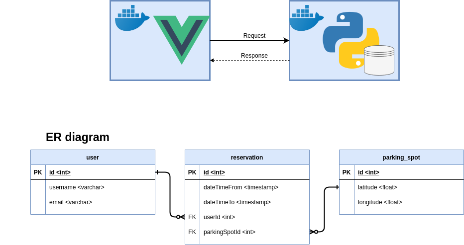

# Parking spot application
### About the project
Full-stack challenge with a time limit of maximum 2 working days (because the customers wait and they want to see the prototype yesterday).  
Back-end in Python Flask and front-end in Vue.js.    
Because I am not familiar with using Python for web, this is clearly not ready for a production.  

### Run in Docker
``` bash
sudo docker-compose build
sudo docker-compose up --force-recreate
```
Now visit the application at URL http://localhost:8080

### Run the back-end tests from inside the container
``` bash
sudo docker exec -it backend /bin/bash
python src/Tests.py
```

### TODO:
* make tests independant from each other
* add real not fake database
* authentication
* authorization
* make RESTful resources
* etc.

## Diagram
\
